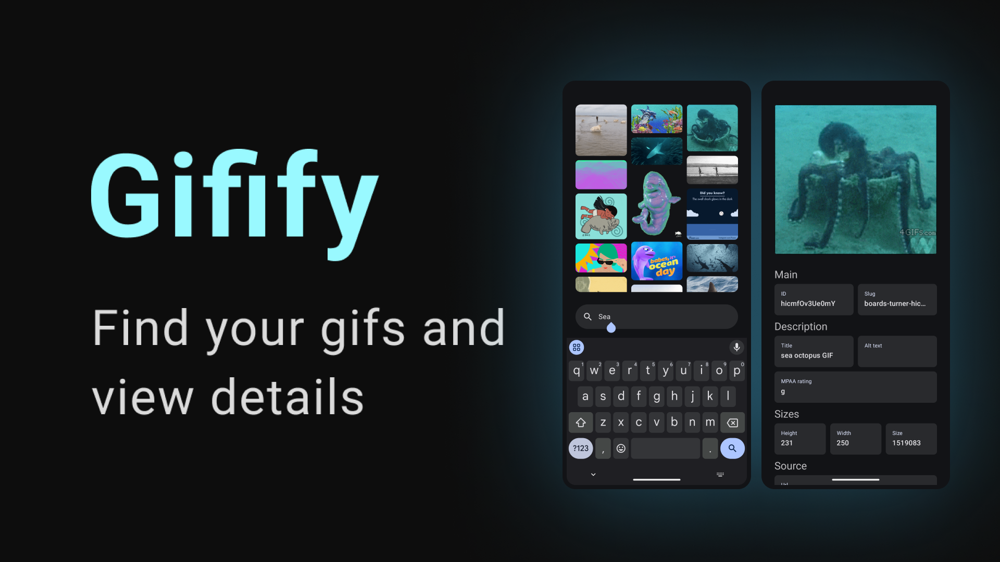

 
   

 

# Gifify

A Kotlin-based Gif Search app using the Giphy API. Features include auto search, pagination, error handling, and orientation support.

## Features
- **Gif Search**: Fetch and display GIFs from Giphy.
- **Auto Search**: Triggers search after a short delay when typing stops.
- **Pagination**: Loads more results as you scroll.
- **Orientation Support**: Works in both vertical and horizontal modes.
- **Error Handling**: Displays user-friendly error messages.
- **Grid Layout**: Search results displayed in a grid.
- **Gif Detail View**: Opens a detailed view on grid item click.
- **Caching Gif**: Fast access from memory.
- **Loading Indicators**: Shown while fetching data.
- **MVVM Architecture** with Jetpack Compose, Coroutines, and Hilt.
- **Network Handling**: Monitors connectivity and informs users.

## Libraries
- **Retrofit**, **Jetpack Compose**, **Coil**, **Hilt**, **Coroutines**, **ViewModel**, **JUnit**, **Mockito**.

## Setup
1. Clone the repository.
2. Obtain a [Giphy API key](https://developers.giphy.com/).
3. Place the API key in the following file:
   `\app\src\main\java\com\yefim\gifsearcher\defaults\Defaults.kt`
4. Build and run the project using Android Studio.

